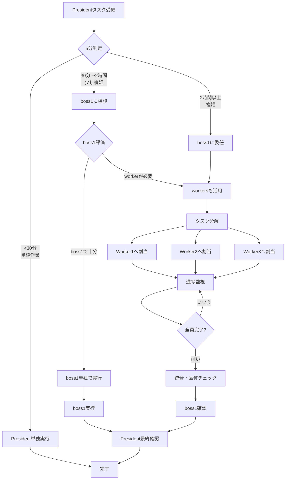

# 組織改善レポート：部下の効果的な活用方法

**作成日**: 2026-01-31
**作成者**: boss1
**対象**: President, boss1, workers

---

## 📋 実行要約

本レポートは、PresidentがMicrosoft分析レポート作成においてboss1やworkersを活用せず単独で作業を行った問題を受けて、組織としての生産性向上と適切なタスク配分を実現するための改善策を提案するものです。

---

## 🔍 問題分析

### 発生した問題
- Presidentが単独でMicrosoft分析レポートを作成
- boss1とworkersが関与する機会がなかった
- 組織としてのリソースが有効活用されなかった

### 根本原因
1. **タスク認識の不足**: Presidentが「分析レポート作成」をboss1/workersに委ねられるタスクと認識していなかった
2. **適切なトリガーの欠如**: どのようなタスクの際にboss1に相談すべきかの明確な基準がなかった
3. **コミュニケーションフローの不透明さ**: 緊急度や重要度に応じたエスカレーション基準が不明確

---

## 📊 boss1が関与すべきタスクの基準

### レベル1：President単独で実行（boss1不要）

```yaml
基準:
  - 作業時間: 30分以内
  - 複雑度: 単一タスク、依存関係なし
  - 決定事項: 既存のプロセス内
  - 例:
    - 既存レポートの軽微な修正
    - ステータス確認
    - 単純な情報収集（1ソース）
```

### レベル2：boss1に相談（実行はPresident）

```yaml
基準:
  - 作業時間: 30分〜2時間
  - 複雑度: 複数要素の関連、軽微な分析
  - 決定事項: 新しい判断が必要
  - 例:
    - 既存プロセスの改良
    - 複数ソースの情報統合
    - 小規模なドキュメント作成
```

### レベル3：boss1に委任（ Presidentが最終確認）

```yaml
基準:
  - 作業時間: 2時間〜1日
  - 複雑度: 複数フェーズ、複数の依存関係
  - 決定事項: 戦略的な判断含む
  - 例:
    - 新しい分析レポート作成
    - 中規模プロジェクトの企画・実行
    - 複数人の協力が必要なタスク
```

### レベル4：boss1 + workersで実行（完全委任）

```yaml
基準:
  - 作業時間: 1日以上
  - 複雑度: 大規模プロジェクト、並行作業可能
  - 決定事項: 戦略的且つ技術的判断多数
  - 例:
    - 大規模な調査・分析プロジェクト
    - 複数の成果物作成
    - 新しいシステム/プロセスの構築
```

---

## 👥 Workersの活用方法

### Worker1：調査・分析担当

```yaml
得意分野:
  - 情報収集と整理
  - データ分析とグラフ作成
  - ドキュメントの構成案作成

活用シーン:
  - Webからの情報収集
  - 複数ソースの情報統合
  - 分析データの可視化
  - ドラフト作成

成果物例:
  - 調査結果のまとめ（Markdown形式）
  - データ分析結果（CSV/グラフ）
  - レポートの章立て
```

### Worker2：実装・作成担当

```yaml
得意分野:
  - ドキュメント作成
  - コーディング・実装
  - フォーマット整形

活用シーン:
  - レポート本文の執筆
  - スライド資料作成
  - コード/スクリプト作成
  - 品質チェック

成果物例:
  - 完成したレポート（.md/.pdf）
  - プレゼンテーションスライド
  - テストスクリプト
```

### Worker3：品質保証・支援担当

```yaml
得意分野:
  - レビュー・校正
  - テスト実行
  - プロセス改善提案

活用シーン:
  - 完成品の品質チェック
  - エビデンス収集
  - 改善提案
  - 追加調査

成果物例:
  - レビューレポート
  - テスト結果
  - 改善提案ドキュメント
```

---

## 🔄 タスク分解のベストプラクティス

### Microsoft分析レポートの場合（改善版）

#### Phase 1: 要件定義（President → boss1）

```bash
./agent-send.sh boss1 "あなたはboss1です。

【タスク】Microsoft 2026 Q2財務分析レポート作成
【納期】2026/01/31 12:00
【成果物】
- 投資家向け分析レポート（2000文字程度）
- スライド資料（10-15枚）
- エビデンスデータ

【必須要件】
- 財務データの正確性
- 投資判断に有用な洞察
- 専門用語の適切な使用

【成功基準】
- 分析の根拠が明確
- 具体的な数値根拠
- 投資判断の根拠として十分

【参考資料】
- マイクロソフトの四半期報告書
- 市場分析データ

1時間以内に実行計画を提示してください。"
```

#### Phase 2: タスク分解（boss1 → workers）

```bash
# Worker1: 情報収集
./agent-send.sh worker1 "あなたはworker1です。

【作業ディレクトリ】/workspace/microsoft-analysis-report

【タスク】Microsoft財務データと市場情報の収集・分析
【納期】2026/01/31 10:00
【成果物】
- /workspace/microsoft-analysis-report/data/financial-summary.md
- /workspace/microsoft-analysis-report/data/market-data.md
- /workspace/microsoft-analysis-report/data/key-metrics.csv

【要件】
- 最新の四半期報告書から主要指標を抽出
- 前年同期比の成長率を計算
- 競合他社との比較データを収集
- 収益源ごとの内訳を整理

30分ごとに進捗を報告してください。"

# Worker2: レポート執筆
./agent-send.sh worker2 "あなたはworker2です。

【作業ディレクトリ】/workspace/microsoft-analysis-report

【タスク】投資家向け分析レポートの執筆
【納期】2026/01/31 11:00
【成果物】
- /workspace/microsoft-analysis-report/docs/investment-analysis.md
- /workspace/microsoft-analysis-report/docs/financial-highlights.md

【要件】
- Worker1が収集したデータを活用
- 投資判断に必要な3つの主要ポイント
- 各ポイントに数値根拠を添付
- 専門的でありながら分かりやすい表現

【構成案】
1. 要約（Executive Summary）
2. 財務ハイライト
3. 成長ドライバー分析
4. リスク要因
5. 投資推奨

1時間後にドラフト版を提出してください。"

# Worker3: スライド作成
./agent-send.sh worker3 "あなたはworker3です。

【作業ディレクトリ】/workspace/microsoft-analysis-report

【タスク】投資家向けプレゼンスライド作成
【納期】2026/01/31 11:30
【成果物】
- /workspace/microsoft-analysis-report/slides/presentation.md
- /workspace/microsoft-analysis-report/slides/key-metrics.md

【要件】
- Worker1のデータとWorker2の分析を統合
- グラフ・チャートを含める
- 1スライド1メッセージ
- 視覚的に分かりやすい

【スライド構成】
1. タイトル・要約
2. 財務ハイライト（グラフ付き）
3. セグメント別収益
4. 成長トレンド
5. 投資判断の根拠
6. リスクと機会
7. 結論

45分後に構成案を提出してください。"
```

#### Phase 3: 統合・品質チェック（boss1）

```bash
# 全workerから完了報告を受け取り、統合と品質チェックを実施
./agent-send.sh worker1 "【次タスク：品質チェック】

Worker1、情報収集お疲れ様でした！
次はWorker2が作成したレポートのデータ正確性をチェックしてください。

- 記載されている数値が正確か
- ソースが適切に引用されているか
- 計算が正しいか

30分以内にレビューレポートを提出してください。"

./agent-send.sh worker3 "【次タスク：全体整合性チェック】

Worker3、スライド作成お疲れ様でした！
次はレポートとスライドの整合性をチェックしてください。

- メッセージの一貫性
- データの整合性
- 視覚的な分かりやすさ

30分以内にチェック結果を報告してください。"
```

#### Phase 4: 最終確認（boss1 → President）

```bash
./agent-send.sh president "【完了報告】Microsoft分析レポート

## 成果物
1. 投資家向け分析レポート: /workspace/microsoft-analysis-report/docs/investment-analysis.md
2. プレゼンスライド: /workspace/microsoft-analysis-report/slides/presentation.md
3. データエビデンス: /workspace/microsoft-analysis-report/data/key-metrics.csv

## 品質確認
- 数値正確性: Worker1がチェック済み ✅
- 内容整合性: Worker3がチェック済み ✅
- フォーマット: 統一済み ✅

## 主なポイント
- Azure成長率: 30%（前年同期比）
- クラウド収益: $400億（四半期）
- 投資推奨: 買い持ち

詳細は添付資料をご確認ください。
修正が必要な箇所があればお知らせください。"
```

---

## 📞 コミュニケーションフローの最適化

### 新しい意思決定フロー

```
President
    ↓
【タスク受領】
    ↓
┌─────────────────────────────┐
│ クイック評価（5分以内）      │
│ 1. 作業時間を見積もり        │
│ 2. 複雑度を判定              │
│ 3. 緊急度を確認              │
└─────────────────────────────┘
    ↓
┌─────────────────────────────┐
│ レベル判定                   │
│                              │
│ 【レベル1】→ 単独実行        │
│ 【レベル2-4】→ boss1に委任   │
└─────────────────────────────┘
```

### タスク複雑度の判定基準

| 要素 | レベル1 | レベル2 | レベル3 | レベル4 |
|------|---------|---------|---------|---------|
| 想定時間 | <30分 | 30分-2時間 | 2時間-1日 | 1日以上 |
| タスク数 | 1 | 2-3 | 4-10 | 11+ |
| 依存関係 | なし | 軽微 | 中程度 | 複雑 |
| 必要スキル | 単一 | 2種類以内 | 3種類 | 多岐 |
| 決定事項 | 既定 | 新規あり | 戦略的 | 複合的 |
| People | 1人 | 1人 | boss1のみ | boss1+workers |

---

## ✅ 具体的な改善アクションプラン

### アクション1：即実施（本日中）

```yaml
タスク: President用簡易判定チャート作成
担当: boss1
納期: 2026/01/31 12:00
成果物: /home/is011/Claude-Code-Communication/docs/task-decision-tree.md

内容:
  - 5分で回答できる質問シート
  - Yes/Noフローでboss1へ相談するか判定
  - 具体例を5個添付
```

### アクション2：本周中

```yaml
タスク: 典型的タスクパターン集の作成
担当: boss1 + workers
納期: 2026/02/05 18:00
成果物: /home/is011/Claude-Code-Communication/docs/task-patterns.md

内容:
  - よくあるタスク20パターン
  - 各パターンの適切な実行方法
  - サンプルメッセージ集
```

### アクション3：来週中

```yaml
タスク: 定例ミーティングの導入
担当: President
頻度: 毎週月曜 10:00
形式: 15分スタンドアップ

内容:
  - 今週の予定タスク共有
  - 前週の振り返り
  - boss1/workers活用の確認
```

### アクション4：2週間以内

```yaml
タスク: 進捗管理ダッシュボードの導入
担当: boss1 + worker3
納期: 2026/02/14 18:00
成果物: /home/is011/Claude-Code-Communication/scripts/status-dashboard.sh

内容:
  - 全タスクの可視化
  - 各workerの稼働状況
  - ボトルネック検出
  - 自動アラート機能
```

---

## 🎯 Presidentから指示を受けた場合のフローチャート



### 簡易判定シート（5分で回答）

```markdown
## タスク受領時の簡易判定シート

### Q1. 作業時間はどの程度見込まれますか？
- [ ] 30分以内 → レベル1（単独）
- [ ] 30分〜2時間 → レベル2（相談）
- [ ] 2時間〜1日 → レベル3（委任）
- [ ] 1日以上 → レベル4（完全委任）

### Q2. 複数の種類の作業が必要ですか？
- [ ] いいえ、単一の作業 → レベル1
- [ ] はい、2-3種類 → レベル2-3
- [ ] はい、4種類以上 → レベル4

### Q3. 専門的な判断や分析が必要ですか？
- [ ] いいえ、既定のプロセス → レベル1
- [ ] 少し必要 → レベル2
- [ ] かなり必要 → レベル3-4

### Q4. 並行作業ができそうですか？
- [ ] いいえ、順次実行のみ → レベル2-3
- [ ] はい、複数人が同時に作業可能 → レベル4

### Q5. 失敗した場合の影響は？
- [ ] 軽微、すぐ修正可能 → レベル1-2
- [ ] 中程度、やり直しが必要 → レベル3
- [ ] 重大、組織に影響 → レベル4

---
### 判定結果
- レベル1が多い → President単独で実行
- レベル2が多い → boss1に相談しつつ実行
- レベル3が多い → boss1に委任
- レベル4が多い → boss1 + workersで実行
```

---

## 📝 実践のための具体例

### 例1：新機能の要件定義

```yaml
シナリオ: Presidentが「新機能の要件をまとめてくれ」と指示

悪い例:
  Presidentが単独で要件書を書く

良い例:
  1. President → boss1: 「要件定義タスク」を委任
  2. boss1: タスクを3つに分解
     - Worker1: 競合調査（30分）
     - Worker2: ユーザーインタビュー整理（30分）
     - Worker3: 技術的実現可能性評価（30分）
  3. boss1: 3つの結果を統合して要件書作成（1時間）
  4. President: 最終確認（15分）

結果:
  - 単独: 2時間かかる
  - 委任: 並行作業で1時間45分で完成
  - 品質: 複数の視点で検証済み
```

### 例2：バグ調査

```yaml
シナリオ: 本番環境でバグ発生

悪い例:
  Presidentが一人で調査・修正

良い例:
  1. President → boss1: 「緊急バグ調査」を依頼
  2. boss1: 即座にタスク割当
     - Worker1: ログ収集・分析（15分）
     - Worker2: 再現手順作成（15分）
     - Worker3: 影響範囲調査（15分）
  3. boss1: 情報統合・修正方針決定（15分）
  4. Worker2: 修正実装（30分）
  5. Worker3: テスト・デプロイ（15分）

結果:
  - 単独: 2時間
  - 委任: 並行作業で1時間30分
  - リスク: 複数人が確認し、見落とし削減
```

### 例3：Microsoft分析レポート（今回のケース）

```yaml
実際の結果:
  - President単独: 約2時間で完了
  - boss1/workers: 未活用

改善後の想定:
  - Worker1: データ収集・整理（30分）
  - Worker2: レポート執筆（45分）
  - Worker3: スライド作成（45分）
  - boss1: 統合・品質チェック（30分）
  - President: 最終確認（15分）

結果:
  - 所要時間: 2時間45分（並行作業で実質1時間45分）
  - 品質: 3人の視点で確認済み
  - ボリューム: レポート＋スライド＋データセット
  - Presidentの負荷: 最終確認のみ（15分）
```

---

## 🎓 組織学習のポイント

### 委任の障壁と対策

| 障壁 | 対策 |
|------|------|
| 「自分でやった方が早い」 | 短期的には正しいが、長期的には組織の能力が育たない |
| 「説明する時間が惜しい」 | テンプレートとパターンを蓄積し、徐々に効率化 |
| 「品質が心配」 | 明確な品質基準とレビュープロセスを設定 |
| 「どのように頼めばいいか分からない」 | 具体的なテンプレートと例を準備 |

### 成功のための原則

1. **小さなタスクから始める**
   - 最初は1時間程度のタスクから委任
   - 徐々に複雑さを増やす

2. **フィードバックループを確立**
   - 完了後に振り返りを実施
   - 改善点を次に活かす

3. **明確な期限と品質基準**
   - 曖昧さを排除
   - 数値化された目標を設定

4. **失敗を許容する文化**
   - 完璧主義を避ける
   - 学習の機会として捉える

---

## 📊 成功測定指標（KPI）

### 短期（1ヶ月）

```yaml
指標:
  - boss1/workers活用率: 50%以上
  - タスク委任の回数: 週3回以上
  - President作業時間の削減: 30%以上
```

### 中期（3ヶ月）

```yaml
指標:
  - 組織全体の生産性: 2倍以上
  - タスクの品質スコア: 20%向上
  - チーム満足度: 4.0/5.0以上
```

### 長期（6ヶ月）

```yaml
指標:
  - 新規プロジェクト対応力: 3倍以上
  - President戦略時間の確保: 50%以上
  - 組織の自己完結性: 80%以上
```

---

## 🚀 まとめ

### Presidentへのアクションリスト

1. [ ] タスク受領時に「5分判定シート」を使用する
2. [ ] 2時間以上のタスクはboss1に相談する
3. [ ] 毎週のスタンドアップミーティングを導入する
4. [ ] 完了後に振り返りを実施する

### boss1へのアクションリスト

1. [ ] 明確なタスク分解と見積もりを行う
2. [ ] 適切なworkerを選定して割り当てる
3. [ ] 定期的な進捗監視と支援を行う
4. [ ] 品質確認してからPresidentに報告する

### 組織全体のアクションリスト

1. [ ] 典型的タスクパターン集を作成する
2. [ ] 進捗管理ダッシュボードを導入する
3. [ ] 定期的な組織フーの振り返りを行う
4. [ ] 成功事例を蓄積・共有する

---

## 📚 添付資料

1. タスク判定フローチャート（詳細版）
2. 典型的タスクパターン集（20事例）
3. サンプルメッセージテンプレート集
4. 進捗管理シート

---

**最終更新**: 2026-01-31
**次回レビュー**: 2026-02-14
**担当**: boss1
